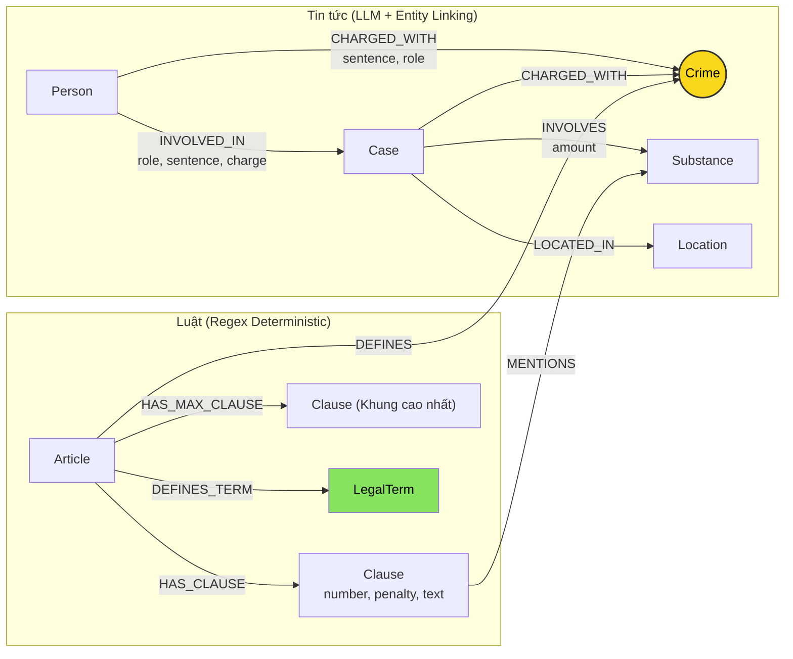

# Thiết kế Ontology — Day 19

**Họ tên:** Tạ Đăng Dương  **MSSV:** 2A202603018

**Lựa chọn** (đánh dấu một):
- [ ] Dùng ontology gợi ý (có thể chỉnh nhỏ)
- [x] Tự thiết kế (xét bonus +15, xem `SUBMISSION.md`)

## 1. Sơ đồ

Node cầu nối chính: **`Crime`** (nối hành vi/tội danh vụ án sang điều khoản luật quy định).
Node cầu nối mở rộng: **`Substance`** (kết nối loại ma túy thu giữ với định khung hình phạt trong từng khoản).

## 2. Entity types (node labels)

| Label | Ý nghĩa | Khóa định danh (`MERGE` theo) | Properties | Lấy từ KB nào | Trích bằng (regex / LLM / khác) |
| --- | --- | --- | --- | --- | --- |
| `Article` | Điều luật cụ thể | `id` | `id`, `title`, `law`, `doc_id`, `max_clause` | Luật | Regex

 |
| `Clause` | Khoản của Điều luật | `id` | `id`, `number`, `penalty`, `text`, `doc_id` | Luật | Regex

 |
| `Crime` | Tội danh chuẩn hóa | `name` | `name` | Cả hai | Regex (luật), LLM + `link_entity` (tin)

 |
| `Case` | Vụ án / vụ việc | `name` | `name`, `summary`, `date`, `doc_id`, `source_title` | Tin tức | LLM

 |
| `Person` | Cá nhân liên quan | `name` | `name`, `aliases` | Tin tức | LLM

 |
| `Substance` | Chất ma túy / tiền chất | `name` | `name` | Cả hai | Regex + Synonyms map (luật & tin)

 |
| `Location` | Tỉnh / thành phố | `name` | `name` | Tin tức | LLM

 |
| `LegalTerm` | Thuật ngữ / định nghĩa luật | `name` | `name`, `definition`, `doc_id` | Luật | Regex

 |

## 3. Relationships

| Type | Từ → Đến | Properties trên cạnh | Ý nghĩa |
| --- | --- | --- | --- |
| `DEFINES` | `Article` → `Crime` | (không) | Điều luật định nghĩa tội danh

 |
| `HAS_CLAUSE` | `Article` → `Clause` | (không) | Điều luật gồm các khoản

 |
| `HAS_MAX_CLAUSE` | `Article` → `Clause` | (không) | Khoản có khung phạt cao nhất của điều

 |
| `DEFINES_TERM` | `Article` → `LegalTerm` | (không) | Điều luật giải thích thuật ngữ pháp lý

 |
| `MENTIONS` | `Clause` → `Substance` | (không) | Khoản luật viện dẫn chất ma túy

 |
| `CHARGED_WITH` | `Case` → `Crime` | (không) | Vụ án bị khởi tố/xét xử theo tội danh

 |
| `CHARGED_WITH` | `Person` → `Crime` | `sentence`, `role` | Cá nhân trực tiếp chịu trách nhiệm về tội danh

 |
| `INVOLVED_IN` | `Person` → `Case` | `role`, `sentence`, `charge` | Cá nhân tham gia trong vụ án

 |
| `INVOLVES` | `Case` → `Substance` | `amount` | Vụ án có tang vật là chất ma túy và khối lượng

 |
| `LOCATED_IN` | `Case` → `Location` | (không) | Địa bàn xảy ra vụ án

 |

## 4. Node cầu nối giữa 2 KB

* **Node nào:** `Crime` (chính) và `Substance` (phụ).

* **Vì sao chọn node này:** Văn bản tin tức luôn đề cập tội danh bị truy tố của đối tượng, trong khi Bộ luật Hình sự tổ chức các Điều luật theo tên tội danh. Do đó `Crime` là cầu nối trực tiếp và tự nhiên nhất giữa hai miền dữ liệu.

* **Cách đảm bảo hai phía khớp tên:**
1. Trích xuất danh mục tội danh chuẩn từ tiêu đề các Điều luật (`normalize_crime`).

2. Đưa danh mục chuẩn vào prompt trích xuất LLM.

3. Sử dụng `link_entity`: chuẩn hóa chuỗi, đối sánh chính xác, fallback sang fuzzy match (`difflib.get_close_matches`, cutoff=0.8) để xử lý biến thể dấu (ví dụ: `ma tuý` vs `ma túy`).

* **Khi nào cầu gãy, và bạn xử lý thế nào:**
* *Cầu gãy khi:* Bài báo dùng từ ngữ mô tả hành vi dân dã không trùng tên tội danh pháp lý, hoặc vụ án có nhiều đồng phạm mang nhiều tội danh khác nhau làm loãng quan hệ.

* *Cách xử lý:* Thêm quan hệ trực tiếp `(:Person)-[:CHARGED_WITH]->(:Crime)` gắn kèm thuộc tính mức án và vai trò; đồng thời bổ sung bảng ánh xạ từ đồng nghĩa `SUBSTANCE_SYNONYMS` để kết nối bổ trợ qua `Substance`.

## 5. Competency questions

| Câu | Đường đi (Cypher pattern) | Trả lời được? |
| --- | --- | --- |
| Q1 | `(:Article)-[:DEFINES_TERM]->(:LegalTerm)` | Có

 |
| Q2 | `(:Person)-[:INVOLVED_IN]->(:Case)` | Có

 |
| Q3 | `(:Person {name:'Lê Minh Thành'})-[:CHARGED_WITH]->(:Crime)<-[:DEFINES]-(:Article)-[:HAS_CLAUSE]->(:Clause {number:1})` | Có

 |
| Q4 | `(:Case {name:...})-[:CHARGED_WITH]->(:Crime)<-[:DEFINES]-(:Article)-[:HAS_MAX_CLAUSE]->(:Clause)` | Có

 |
| Q5 | `(:Person {name:'Cái Quang Huy'})-[:INVOLVED_IN]->(k:Case)-[:CHARGED_WITH]->(:Crime)<-[:DEFINES]-(:Article)-[:HAS_CLAUSE]->(cl:Clause)-[:MENTIONS]->(:Substance)<-[:INVOLVES]-(k)` | Có

 |
| Q6 | `(:Case)-[:INVOLVES]->(:Substance {name:'MDMA'})` | Có

 |

## 6. Quyết định thiết kế và đánh đổi

1. **Thêm quan hệ trực tiếp `(:Person)-[:CHARGED_WITH]->(:Crime)`:**
* *Phương án khác:* Chỉ nối `Person -> Case -> Crime` như ontology gợi ý.

* *Vì sao chọn:* Trong các vụ án có nhiều bị cáo (đồng phạm), đi qua node trung gian `Case` khiến facts chứa thông tin mức án của toàn bộ đồng phạm, dẫn tới việc LLM bị ảo giác gán nhầm án (Q3 bị nhầm sang 24 tháng tù của bị cáo khác). Nối trực tiếp giúp cô lập trách nhiệm hình sự của từng cá nhân.

* *Đánh đổi:* Đồ thị tăng thêm cạnh (tổng 432 cạnh so với 385 cạnh ban đầu).

2. **Thêm node `LegalTerm` từ các điều khoản định nghĩa:**
* *Phương án khác:* Chỉ trích xuất các Điều luật có cấu trúc "Tội ..." thành `Crime`.

* *Vì sao chọn:* Các điều luật định nghĩa khái niệm (như Điều 2 Luật Phòng chống ma túy định nghĩa "tiền chất") không chứa tội danh nên bị bỏ qua trong ontology gợi ý, khiến Q1 bị GraphRAG trả về "Không đủ thông tin".

* *Đánh đổi:* Thêm bước regex phân tích cấu trúc định nghĩa ở khâu nạp luật.

3. **Thêm cạnh `HAS_MAX_CLAUSE` và tham số truy vấn khung hình phạt cao nhất:**
* *Phương án khác:* Chỉ mặc định lấy `cl.number = 1` để tiết kiệm context window.

* *Vì sao chọn:* Các câu hỏi về mức phạt tối đa (Q4) đòi hỏi phải tiếp cận được khoản tăng nặng cao nhất thay vì chỉ khung cơ bản ở khoản 1.

* *Đánh đổi:* Cần thêm logic phát hiện intent trong hàm `context()`.

## 7. So với ontology gợi ý (bắt buộc nếu xét bonus)

| Điểm khác | Gợi ý làm gì | Bạn làm gì | Vấn đề nó giải quyết | Bằng chứng (Cypher, hoặc số liệu benchmark) |
| --- | --- | --- | --- | --- |
| **Trách nhiệm cá nhân trực tiếp** | `Person` chỉ nối tới `Case` qua `INVOLVED_IN`  | Thêm cạnh trực tiếp `(Person)-[:CHARGED_WITH]->(Crime)`  | Tránh trộn lẫn mức án giữa các đồng phạm trong cùng một vụ án

 | Q3 từ **Judge=0, Recall=0.00** (`hint.txt`) tăng lên **Judge=2, Recall=1.00** (`benchmark_kg.txt`)

 |
| **Mô hình hóa định nghĩa luật** | Bỏ qua các Điều luật không có tiêu đề "Tội..."

 | Thêm node `LegalTerm` và quan hệ `DEFINES_TERM`  | Trả lời được các câu hỏi định nghĩa pháp lý thuần túy (tiền chất, chất ma túy)

 | Q1 từ **Judge=0, Recall=0.00** ("Không đủ thông tin") tăng lên **Judge=2, Recall=1.00**  |
| **Ánh xạ từ đồng nghĩa ma túy** | Chỉ tìm theo danh sách tên chuẩn cố định

 | Tích hợp bảng ánh xạ `SUBSTANCE_SYNONYMS` (thuốc lắc $\rightarrow$ MDMA, cỏ mỹ $\rightarrow$ cần sa...)

 | Gom đúng các vụ án dùng tiếng lóng / tên thương mại của chất ma túy

 | Q6 từ **Recall=0.33** tăng lên **Recall=0.67**, gom đủ 5 vụ việc liên quan đến MDMA trong tin tức

 |

## 8. Hạn chế còn lại

* Chưa giải quyết triệt để bài toán trích xuất ngưỡng khối lượng phức tạp dạng số học trong các điểm của từng khoản luật bằng Neo4j property graph (vẫn cần sự suy luận văn bản của LLM ở bước cuối).

* Tên vụ án (`Case.name`) phụ thuộc vào việc đặt tên của LLM, nên nếu 2 bài báo cùng viết về một vụ án nhưng đặt tên khác nhau thì vẫn có khả năng sinh ra 2 node `Case` riêng biệt.